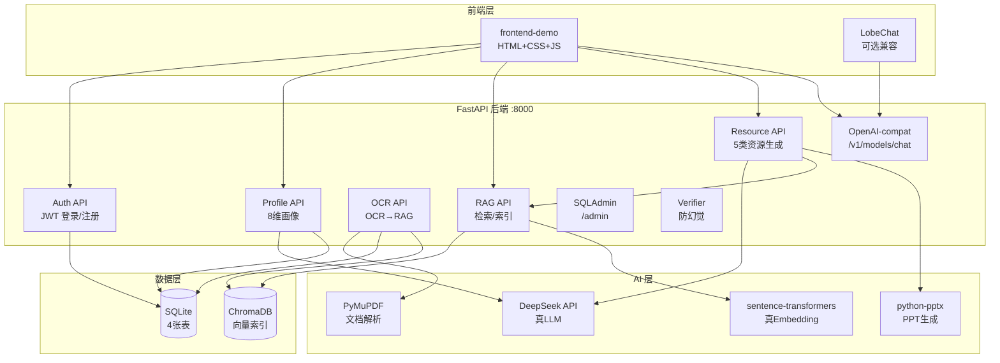
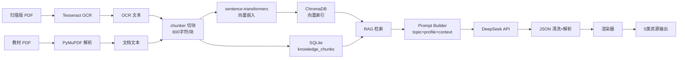
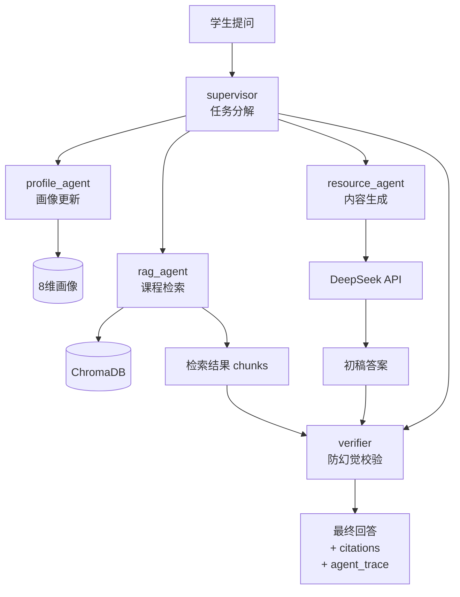
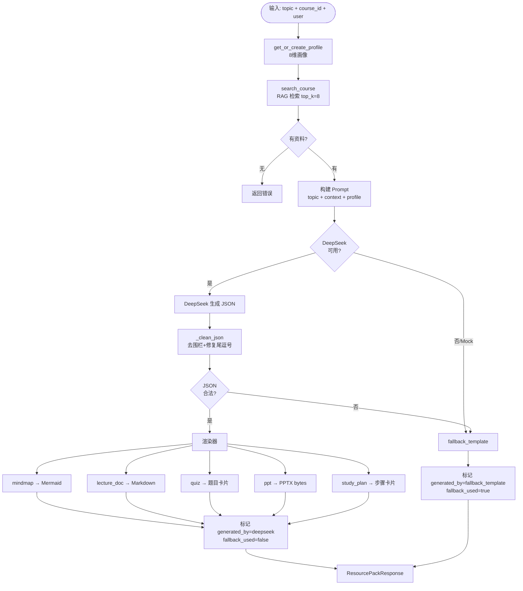

# 系统架构图与流程图

> 全部使用 Mermaid 语法，答辩/报告可直接渲染

---

## 1. 系统总体架构图

**说明**: 前端通过 Bearer Token 访问所有 API。LobeChat 可选接入 /v1 兼容接口。资源生成链路：Profile+RAG → DeepSeek → JSON → 渲染器。

---

## 2. 数据流图

**说明**: 文字型 PDF 经 PyMuPDF 解析，扫描版需 Tesseract OCR。文本切块后同时写入 SQLite(元数据)和 ChromaDB(向量)。RAG 检索时优先向量相似度，前端展示引用来源。

---

## 3. 多智能体流程图

**说明**: LangGraph 多 Agent 工作流。supervisor 调度各子 Agent，profile_agent 维护画像，rag_agent 检索课程资料，resource_agent 调用 DeepSeek 生成内容，verifier 校验答案与资料一致性并标注引用来源。

---

## 4. 资源生成流程图

**说明**: 统一生成管线。优先真 LLM，失败或 Mock 时 fallback 到模板。每个资源标记 generated_by 和 fallback_used，前端可据此展示生成来源。
